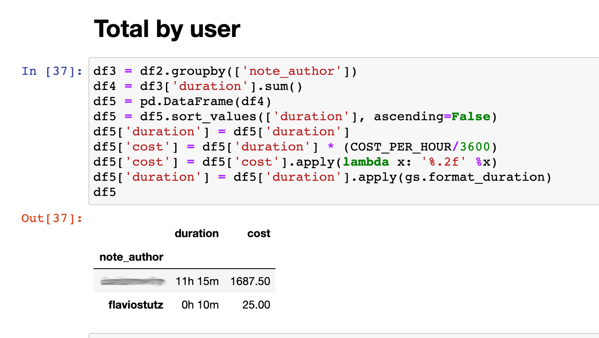

# gitlab-reports
Creates reports on spent time for Gitlab issues by author.

This work began from the great job of https://gitlab.com/incomprehensibleaesthetics/gitlab-cli-reports, but then we went to a Jupyter version.

## Example report

### Time/cost by issue


### Total by user


## Usage

* Create a docker-compose.yml file

```
version: '3.6'
services:
  gitlab-reports:
    image: stutzlab/gitlab-reports
    environment:
      - JUPYTER_TOKEN=abc123
    ports:
      - 8888:8888
```

* Run ```docker-compose up```

* Open browser at http://localhost:8888

* Type password "abc123"

* Click on "gitlab-timespent.ipynb"

* On first cell, set GITLAB_ACCESS_TOKEN to your token (get token in Gitlab -> Profile -> Settings -> Access Tokens)

* Set FILTER_DATE_BEGIN, FILTER_DATE_END and FILTER_SEARCH to indicate the range of projects/dates you want to perform analysis

* Click button "Run"

* See results in Notebook cells

## ENVs

* JUPYTER_TOKEN - Jupyter password. required
