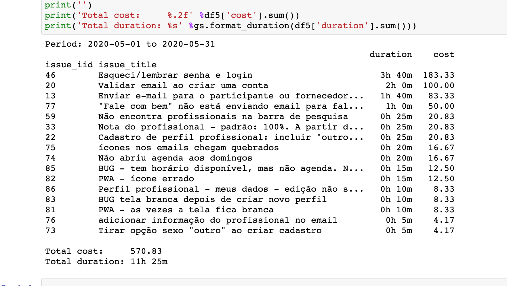

# gitlab-reports
Creates reports on spent time for Gitlab issues by author.

This is basically a Docker container wrapper for https://gitlab.com/incomprehensibleaesthetics/gitlab-cli-reports

## Example report



## Usage

* Create a docker-compose.yml file

```
version: '3.6'
services:
  gitlab-reports:
    image: flaviostutz/gitlab-reports
    environment:
      - GITLAB_ACCESS_TOKEN=testestse
      - FILTER_DATE_BEGIN=2020-05-01
      - FILTER_DATE_END=2020-06-01
      - FILTER_AUTHOR=flaviostutz
      - FILTER_SEARCH=Bem
      - FILTER_ONLY_MEMBER=true
```

* Run ```docker-compose up```

* See report on console output

## ENVs

* GITLAB_URL - . defaults to 'https://gitlab.com'
* GITLAB_ACCESS_TOKEN - Gitlab personal access token. Can be acquired at Profile->Settings->Personal Access Token. required
* FILTER_DATE_BEGIN - only consider time spent on or after this date (format: YYYY-MM-DD)
* FILTER_DATE_END - only consider time spent on or before this date (format: YYYY-MM-DD)
* FILTER_AUTHOR - only consider time spent by this user
* FILTER_SEARCH - only consider time spent on projects whose name matches this search text
* FILTER_ONLY_MEMBER - only consider projects the member is currently a member of. defaults to false
